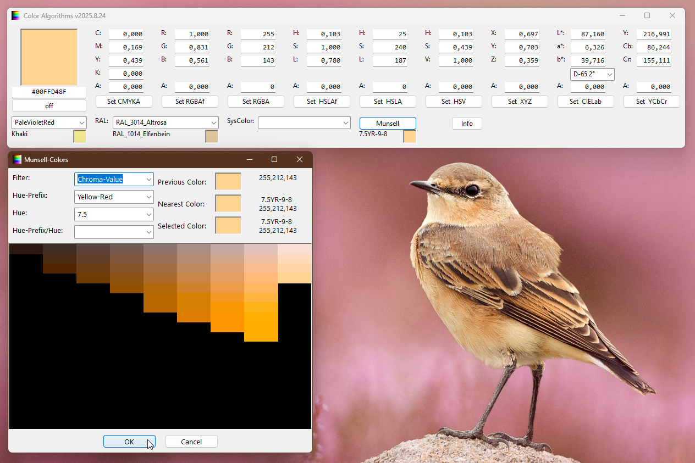

# Color_Algorithms  
## a collection of different algorithms for encoding a color  

 

Project started around mid 2017.  
This is a collection of different algorithms for encoding color-values.  
CMYK, RGB-float, RGB, HSL, HSV, XYZ, CieLab, YCbCr and alpha channel for transparency.  
all X11-knowncolors, all RAL-classic-colors, all Systemcolors and all Munsell-colors are included.  
How to select a color from your screen:  
* click the button on/off and move your mouse across the screen (don't click)  
* now pressing the enter-key on your keyboard activates the on/off-button again and gets the color selected.  
* you get the nearest x11-knowncolor, ral-color or munsell-color below the drop-down-boxes  
  
Some links for further reading:  
* [X11 known colors](https://en.wikipedia.org/wiki/X11_color_names)  
* [RAL-classic colors](https://en.wikipedia.org/wiki/RAL_colour_standard)  
* [RAL-Classic Farben](https://de.wikipedia.org/wiki/RAL-Farbe)  
* [Munsell colors](https://en.wikipedia.org/wiki/Munsell_color_system)  
  
